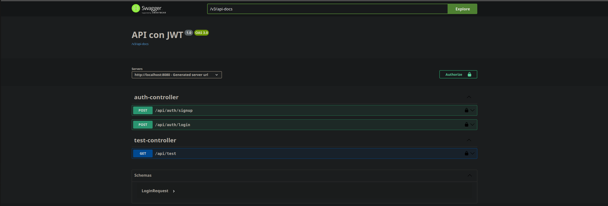
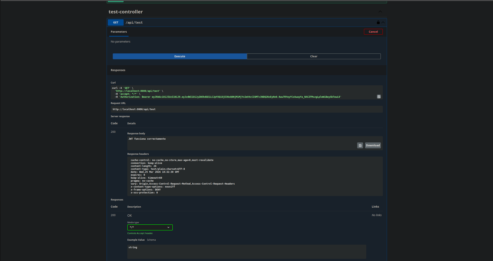

# 🔐 Secure API Backend (JWT Template)


Plantilla reutilizable de autenticación con JWT para proyectos backend en Spring Boot.
Incluye login, registro de usuarios, seguridad stateless y estructura lista para producción.

---

## 🧠 Proyecto de portfolio

Este proyecto está diseñado como una **base reutilizable** para acelerar el desarrollo de APIs seguras con Spring Boot, evitando tener que reconfigurar la seguridad en cada nuevo proyecto.

---

## ⚡ Quick Start

```bash
git clone https://github.com/ChristianBihurriet/secure-api-backend.git
cd secure-api-backend
mvn spring-boot:run
```

API disponible en:

```
http://localhost:8080
```

---

## 🚀 Características

* ✅ Autenticación con JWT
* ✅ Registro y login de usuarios
* ✅ Seguridad stateless (sin sesiones)
* ✅ Filtro JWT personalizado
* ✅ Manejo centralizado de errores
* ✅ Validación de datos
* ✅ Estructura reutilizable para nuevos proyectos

---

## 🏗️ Arquitectura

```text
Controller → Service → Repository → DB
             ↓
         Security Layer (JWT)
```

Incluye:

* **AuthController** → endpoints de login y registro
* **AuthService** → lógica de autenticación y generación de JWT
* **UserRepository** → acceso a usuarios
* **SecurityConfig** → configuración de seguridad

---

## 🔐 Seguridad (JWT)

El sistema utiliza:

* 🔑 Token JWT firmado con clave secreta
* 🛡️ Filtro que intercepta cada request
* 🚫 Acceso protegido por defecto
* ✅ Solo `/api/auth/**` es público

Flujo:

1. Usuario hace login
2. Se genera un JWT
3. Cliente envía el token en cada request
4. El filtro valida el token y autentica

---

## 📡 Endpoints

```http
POST /api/auth/login
POST /api/auth/signup
GET /api/test (protegido)
```

👉 🔐  Requiere JWT válido

---
## 👤 Crear usuario

Dado que la base de datos se genera automáticamente en cada ejecución (H2 en memoria), primero debes crear un usuario.

Desde Swagger:

1. Ejecutar `/api/auth/signup`
2. Crear usuario con:

```json
{
  "username": "admin",
  "password": "admin"
}
```
---
## 📄 Documentación API (Swagger)

La API puede probarse directamente desde Swagger UI:

http://localhost:8080/swagger-ui/index.html


### 🔐 Flujo de autenticación

1. Crear usuario `/api/auth/signup`
2. Ejecutar `/api/auth/login`
3. Copiar el token
4. Pulsar en **Authorize 🔐**
5. Introducir: Bearer TU_TOKEN
6. Probar `/api/test`


## 📦 Ejemplo Login

```json
{
  "username": "admin",
  "password": "admin"
}
```

Respuesta:

```json
{
  "token": "jwt_token",
  "username": "admin",
  "type": "Bearer"
}
```

---

## 🔄 Uso del token

Enviar en headers:

```http
Authorization: Bearer <token>
```

El filtro JWT se encarga de validar automáticamente cada request

---

## 🧩 Modelo de usuario

* username único
* password encriptada (BCrypt)
* roles (USER / ADMIN)

---

## ⚙️ Configuración

### application.properties

```properties
app.jwt.secret=mi_clave_secreta_super_segura
app.jwt.expiration-ms=86400000

## configuracion de DB en este caso h2
spring.datasource.url=jdbc:h2:mem:testdb
spring.jpa.hibernate.ddl-auto=update # para desarrollo (no usar en produccion)
```

---

## 🧪 Testing

El proyecto incluye **tests de integración** utilizando Spring Boot y MockMvc.

Se validan los flujos principales de autenticación:

* ✅ Registro de usuario
* ✅ Login exitoso
* ❌ Login con credenciales incorrectas
* 🚫 Acceso a endpoint protegido sin token
* 🔐 Acceso autorizado con JWT válido

Los tests simulan peticiones HTTP reales contra la API, verificando el comportamiento completo del sistema (controller, security, servicio y base de datos).

---

### ▶️ Ejecutar tests

```bash
mvn test
```

## 📈 Uso como plantilla

Para reutilizar este proyecto:

1. Clona el repositorio
2. Elimina las entidades actuales
3. Crea tus propias entidades y repositorios
4. Mantén la configuración de seguridad (JWT)
5. Ajusta `application.properties`
6. Añade tus endpoints

👉 La capa de seguridad ya está lista para usar

---

## 📸 Demo

### Swagger UI



### Autenticación con JWT

Flujo completo usando Swagger:

1. Login
2. Autorizar con JWT
3. Acceso a endpoint protegido



---

## 📈 Roadmap

* 🧪 Tests
* 🔐 Roles y permisos avanzados
* 📄 Refresh tokens
* 🐳 Docker

---

## 👨‍💻 Autor

**Christian Bihurriet**
Backend Developer (Java + Spring Boot)

---

## ⭐ Notas

Plantilla pensada para evitar repetir configuraciones de seguridad en cada proyecto, siguiendo buenas prácticas de Spring Security y JWT.
